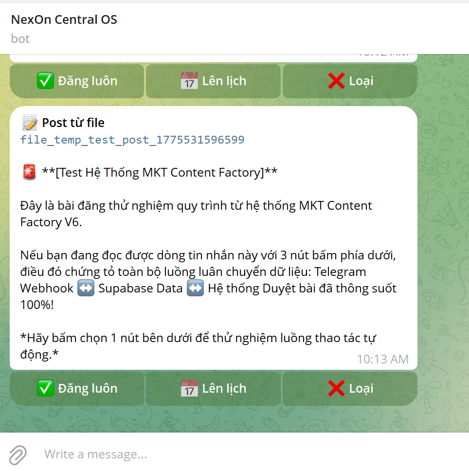

<div align="center">
  
  <br/>
  <h1>🚀 MKT Content Factory V6</h1>
  <p><strong>Hệ thống Tự động hóa Toàn phần (End-to-End Automation) cho Marketing Cá nhân</strong></p>
  <p>
    Lấy dữ liệu từ YouTube ➝ Rút trích Insight bằng AI ➝ Duyệt bài qua Telegram ➝ Đăng tự động lên Facebook bằng Puppeteer.
  </p>
</div>

---

## 📌 Giới thiệu Dự án

**MKT Content Factory** là một kiến trúc tự động hoá nội dung sinh ra để giải quyết bài toán: *"Làm sao để duy trì tính hiện diện liên tục trên mạng xã hội mà không phải lặp lại các công việc tay chân nhàm chán?"*

Thay vì phụ thuộc vào thao tác thủ công, hệ thống sử dụng sức mạnh của **AI Agent**, kết hợp cùng RPA (Robotic Process Automation) đễ xây dựng một dây chuyền sản xuất và phân phối nội dung hoàn toàn tự động, khép kín từ khâu lên ý tưởng tới khâu phân phối. 

Người dùng (Sếp/Marketer) chỉ đóng vai trò **Reviewer** (Người duyệt bài) và bấm nút ủy quyền trên Telegram.

## ⚙️ Tính năng Lõi (Core Features)

- **🕵️ Deep Research Tự động:** Cào và phân tích Transcript của 50 video viral nhất trên YouTube theo từ khóa tùy chỉnh.
- **🧠 Ứng dụng NotebookLM:** Múc (extract) chính xác các insight giá trị từ các mỏ dữ liệu quốc tế.
- **✍️ Triển khai Nội dung Đa góc nhìn:** AI Agent tự động viết 4 format nội dung khác biệt (Storytelling, Case Study, Insight, Mindset) tuân thủ cực chuẩn quy tắc ngữ điệu thương hiệu (Brand Voice).
- **🕹 Telegram Approval Hub:** Tích hợp Webhook Long-polling qua Telegram. Bắn thông báo báo cáo trực quan với các thao tác 1-chạm: `[✅ Đăng Ngay]` | `[📅 Lên Lịch]`.
  <br/>
- **👻 Headless FB Publisher:** Script JavaScript chạy ngầm giả lập trình duyệt (Puppeteer + Stealth Plugin), xuyên qua tường rào của Facebook để post Status + tải Hình ảnh/Video hoàn toàn như người thật.

## 🏗 Kiến trúc Hệ thống

- **Lưu trữ Trạng thái (State Management):** Supabase (PostgreSQL) - Giám sát toàn bộ trạng thái vòng đời bài viết (Pending -> Published -> Failed).
- **Control Center:** Telegram Messenger.
- **RPA Core:** Node.js v20+, Puppeteer.
- **Hạ tầng chạy (Deployment):** Local máy tính cá nhân hoặc Cloud VPS Ubuntu (PM2 Cronjob).

## ⚡️ Quick Start (Cài đặt cấp tốc)
Dự án đã được cấu trúc chuẩn Node.js package. Chỉ cần lấy về và install:

```bash
git clone https://github.com/nguyenxuanngoc2025/mkt-content-factory.git
cd mkt-content-factory
npm install
```

## 🚀 Hướng dẫn Cài đặt Chuyên sâu (Documentation)

Dự án này cung cấp 2 góc độ hướng dẫn cài đặt biến môi trường (Supabase/Telegram) và chạy tiến trình:

1. 👔 **Dành cho Non-Tech (CEO, Quản lý, Marketer không biết code):**
   👉 Đọc File: [GUIDE_CHO_GIAM_DOC_MARKETING.md](./GUIDE_CHO_GIAM_DOC_MARKETING.md) 
   *(Cẩm nang cách sai khiến trợ lý AI tự động cài đặt thay bạn từ A-Z).*

2. 💻 **Dành cho Dân Kỹ thuật, Developer:**
   👉 Đọc File: [README_DEPLOY.md](./README_DEPLOY.md)
   *(Tài liệu thiết lập API, Variables, và crontab chi tiết trên Linux VPS).*

---

## 🛠 Prerequisites (Yêu cầu Môi trường)
- Node.js `v20.x` trở lên.
- Tài khoản Supabase miễn phí.
- 1 Bot Telegram (Tạo qua t.me/BotFather).
- File `cookies.json` trích xuất trạng thái đăng nhập Facebook của bạn.

## 📝 License
Dự án được mã nguồn mở hoàn toàn dựa trên tư duy chia sẻ của cộng đồng làm Tự động hóa. Lấy về, chế lại, mang bán dạo hay làm dịch vụ đều được. Happy Automating!

> **MarTech Builder:** Ngọc Nguyễn (<a href="https://github.com/nguyenxuanngoc2025">@nguyenxuanngoc2025</a>)
